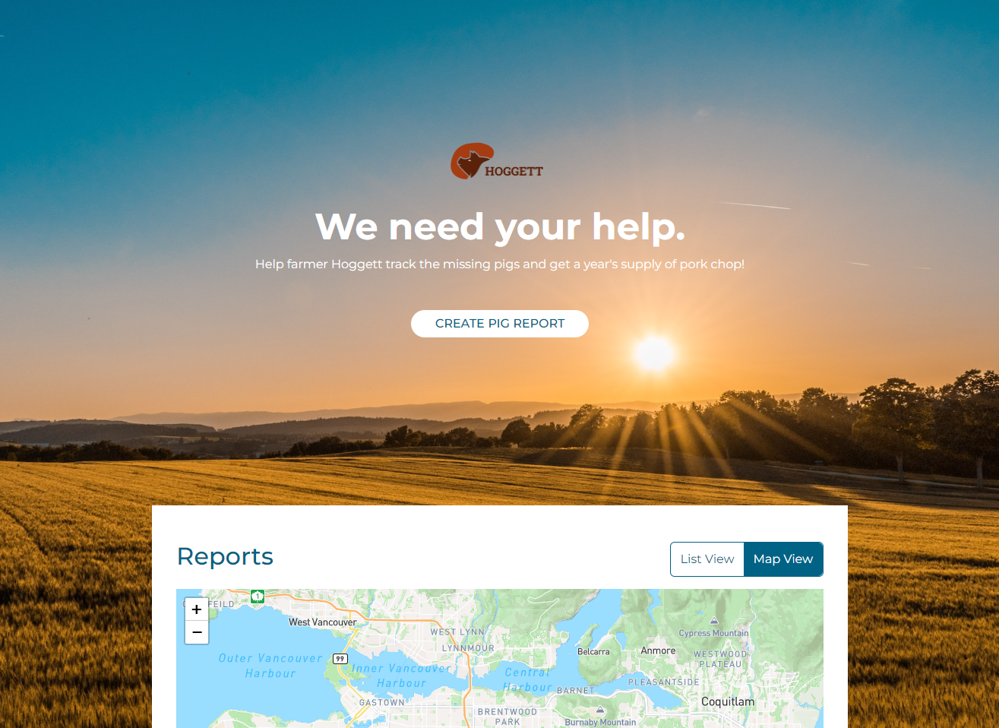
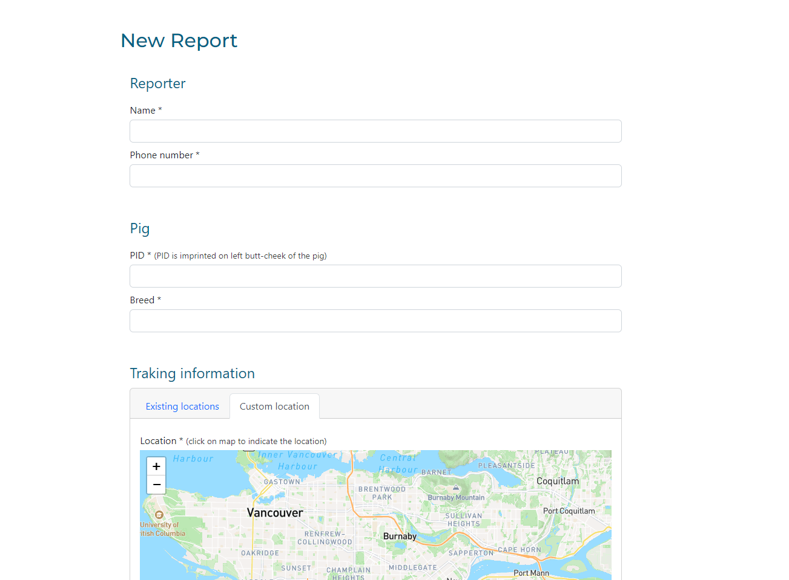

# Pig Tracker
An Angular web application which serves as a platform for reporting and tracking the lost pigs.

## Preview
Main page:

Report form page:


## Technology
* Angular.js
* TypeScript
* HTML/CSS
* Bootstrap
* Leaflet API (https://leafletjs.com/)
* Data Manager API

## Installation
```
1. npm install
2. npm start
```
---
Please note that data storage operations do not work currently as the data manager API (storage server used for this application) has been disabled. Currently working on replacing storage service to Firebase.